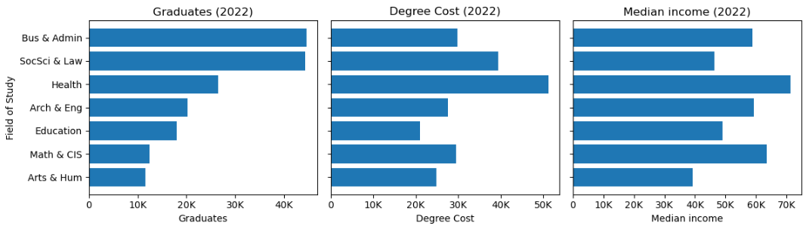

# Is Your Degree Worth It?

## Overview

For thousands of Canadian students, choosing a field of study is both an exciting and high-stakes decision. This is a serious investment and committment that could shape the next few years of their lives and even further. With rising tuition costs, evolving job markets, and growing student debt, one question looms large: **Is my degree worth it?**

This project explores the return on investment (ROI) of undergraduate education in Canada across various fields of study. By connecting tuition costs, graduate numbers, employment rate, and income outcomes, we aim to empower students with data-driven insights to understand the recent trends and make more informed educational and career decisions.

### Why This Matters
For many, education is the largest investment they'll ever make besides buying a home. Yet most students lack access to integrated, interpretable data that tells them:
* Which fields are actually paying off?
* Are popular programs becoming saturated?
* Does higher tuition guarantee higher earnings?
* Are some degrees "bubbles" waiting to burst?

### Files & Structure
* `01-Preprocess_data.ipynb`: ETL steps, metric engineering.
* `02-analyze-education-roi.ipynb`: Trend, correlation, value analysis, and summary table.

## ETL Process
In the notebook `01-Preprocess_data.ipynb`, we perform an end-to-end ETL pipeline using data from Statistics Canada and other public sources. This includes:
* Cleaning and merging multiple datasets: tuition, income, graduation counts, and employment statistics.
* Engineering metrics like degree cost (cumulative tuition over 4 years) and 5-year rolling graduate totals.
* Creating derived KPIs such as ROI and employment stability index.
* Producing a final dataset for analysis and visualization.

## Analysis & Key Findings

The notebook `02-analyze-education-roi.ipynb.ipynb` walks through a structured analysis, designed to uncover trends, patterns, and field-specific insights.

### 1. Education Landscape Overview (2022)
We begin with an overview of how graduates are distributed across fields, both in count and proportion.

#### Key Insights:
* Business & Administration and Social Sciences & Law account for nearly half of all graduates.
* Math & CIS and Health command the highest incomes, while Arts & Humanities lags behind.
* Tuition costs are highest in Health and Social Sciences & Law; Education remains most affordable.

### 2. Trend Analysis - How Have Fields Evolved?
We track how income, tuition, and graduate numbers have changed over time. The table below summarizes how much the cost of a degree and the median income have changed after 10 years.

|Field of study| Degree Cost | Median Income | Graduates |
---|-------------|---------------|-----------|
Architecture & Engineering| +22.84%     | +1.10%        | +46.7%    |
Arts & Humanities| +23.17%     | +9.20%        | -32.79%   |
Business & Administration| +25.30%     | +3.89%        |+18.63%|
Education| +25.45%| -4.39%        |-19.17%|
Health and Related Sciences|+40.90%| +9.35%        |+22.81%|
Mathematics & CIS|+21.92%| +14.02%       |+200.80%|
Social Sciences & Law|+36.24%| +10.21%       |+15.29%|

#### Key Insights:
* Math & CIS shows explosive growth in graduates (200.8%) and the highest income increase, indicating strong demand and labour market alignment.
* Health and Social Sciences & Law also saw above-average income growth but came with high tuition increases, raising questions about cost efficiency.
* Arts & Humanities and Education both experienced significant declines in graduate numbers, with Education even seeing a drop in income, signaling falling appeal and poor return.
* Architecture & Engineering had solid graduate growth but almost no income growth, which may reflect stagnation in earnings despite rising interest.
* Overall, tuition has increased in every field, but income growth has lagged behind in most, weakening the return on investment in several disciplines.

### 3. Value Analysis - ROI, Income, and Tuition
We assess how much financial return each field offers relative to its cost.

#### Key Insights:
* Education and Math & CIS offer the best ROI among all fields.
* The Health field, while lucrative, suffers from high tuition, reducing its ROI.
* Arts & Humanities and Social Sciences & Law provide low financial return, raising cost-effectiveness concerns.

### 4. Market Alignment - Employment Outcomes
This section explores whether graduates are actually finding employment in their chosen fields.

#### Key Insights:
* Math & CIS leads in both graduate growth and employment rate — strong alignment with market demand.
* Education shows high ROI but the lowest employment rate, suggesting possible oversupply.
* Arts & Humanities faces both low growth and weak employment outcomes, reinforcing its high-risk status.

Fields like Math & CIS and Business offer a balanced mix of ROI and employability, while others like Education and Arts & Humanities face real risks of underemployment, despite their affordability or traditional appeal. These trends emphasize the importance of looking beyond tuition or salary alone—and understanding where education meets employability.

### 5. Field Comparison & Risk Flags
A combined view of all metrics, with simple risk flags to help students assess the trade-offs.

| Field of study             | Degree Cost ($) | Median Income ($) | Employment Rate (%) | Graduate Growth Rate (%) |Risk Flag|
|----------------------------|-----------------|-------------------|---------------------|--------------------------|---|
| Education                  | 20,172          | 55,662            | 59.2                | 2.05                     | ️ ⚠️ Limited Jobs|
| Mathematics & CIS          | 29,756          | 65,325            | 74.1                | 13.29                    |✅ Balanced|
| Architecture & Engineering | 27,722          | 57,662            | 67.5                | 1.33                     |✅ Balanced|
| Business & Administration  | 29,775          | 56,150            | 69.3                | 1.71                     |✅ Balanced|
| Arts & Humanities          | 24,595          | 36,594            | 63.9                | -2.06                    |❗ Risky|
| Health & related Sciences  | 49,298          | 68,938            | 67.1                | 3.4                      |❗ Bubble Risk|
| Social Sciences & Law      | 39,484          | 44.612            | 70.3                | 2.49                     |❗ Bubble Risk|

## Conclusions
This analysis reveals that not all degrees offer equal value—either financially or in the job market.
* Fields like **Math & CIS** and **Architecture & Engineering** deliver a strong mix of ROI, employment, and growth, making them highly attractive options for students.
* **Education**, though financially efficient, suffers from **limited job absorption**.
* **Health & related Sciences** offers strong earnings but comes at a significantly higher cost, which lowers its ROI.
* **Arts & Humanities** and **Social Sciences & Law** emerge as **high-risk choices**, combining low ROI, lower employment rates, and signs of **possible oversupply**.
